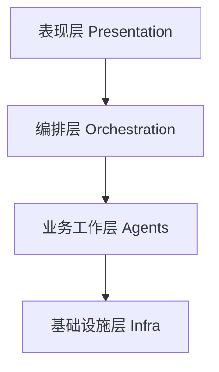
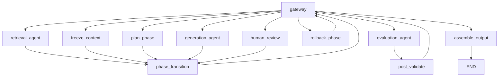
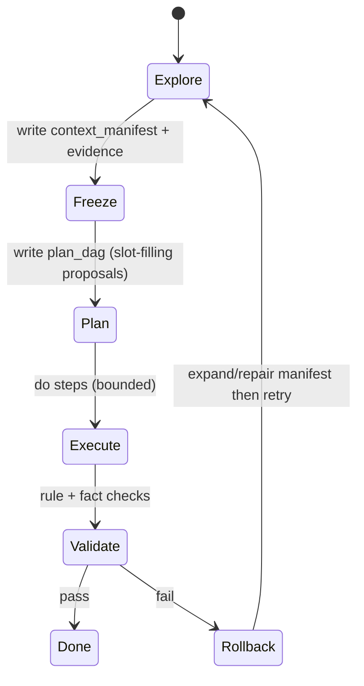
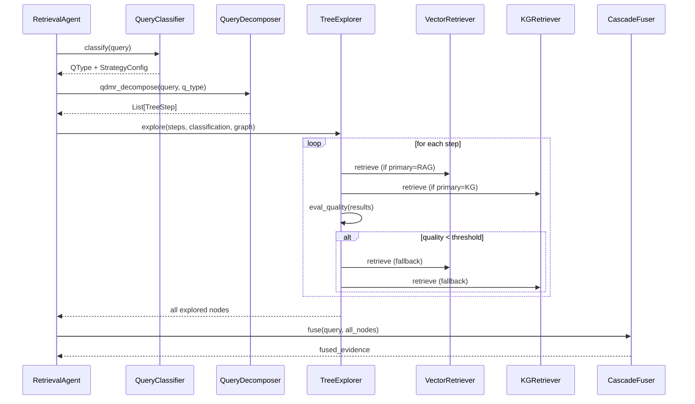
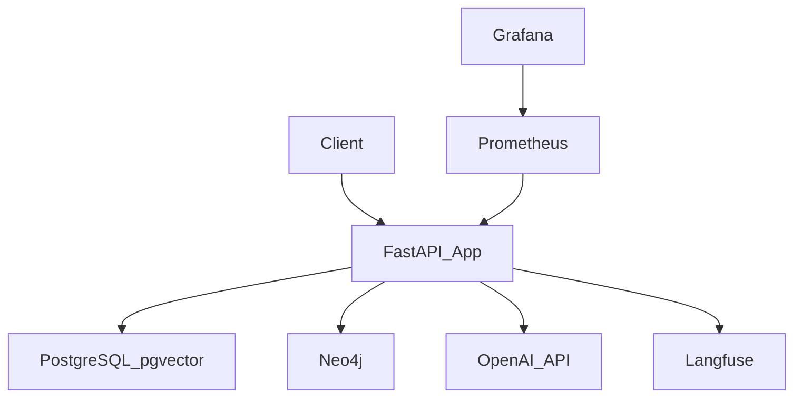

# 昊中多Agent系统 — 系统设计文档

**版本**: v1.0
**日期**: 2026-02-06
**状态**: 初版

---

## 1. 系统架构 — 管理式金字塔

系统采用四层管理式金字塔架构, 每层职责明确, 自上而下单向依赖:



### 1.1 层级职责

| 层级 | 目录 | 职责 | 禁止事项 |
|------|------|------|---------|
| 表现层 | `app/presentation/` | HTTP请求处理, Schema验证, 流式响应 | 不含业务逻辑 |
| 编排层 | `app/orchestration/` | LangGraph图定义, 路由决策, 状态管理 | 不含检索/生成/评估逻辑 |
| 业务工作层 | `app/agents/` | 三个Agent的核心AI逻辑 | 不使用`Command.goto` |
| 基础设施层 | `app/infra/` | 数据库/KG/向量存储/LLM服务 | 不含业务决策 |

### 1.2 核心类型系统

位于 `app/core/types/`, 被所有层共享:

| 类型 | 文件 | 用途 |
|------|------|------|
| Belief | `belief.py` | 置信度模型, 量化Agent对证据的信任度 |
| Intent | `intent.py` | 意图声明, 说明证据为何被产出 |
| Evidence / EvidenceGraph | `evidence.py` | 证据图, Agent间共享的通信黑板 |
| AgentInput / AgentOutput | `agent_io.py` | Worker节点的I/O契约 |
| PipelineState | `state.py` | LangGraph全局状态 |

> **Schema详细文档**: 所有核心类型和表现层Schema的完整字段/约束/方法定义已独立至:
> - `docs/schemas/2026-02-06-v1.0-核心类型Schema文档.md` — Belief, Intent, Evidence, AgentIO, PipelineState, 表现层请求/响应
> - `docs/schemas/2026-02-06-v1.0-检索Agent-QDMR类型Schema文档.md` — QType, StrategyConfig, TreeStep, ClassificationResult

---

## 2. LangGraph编排设计

### 2.1 图拓扑 (Disciplined Agent Workflow State Machine)



### 2.2 状态机阶段 (PipelinePhase)



| 阶段 | 对应节点 | 职责 |
|------|---------|------|
| Explore | retrieval_agent | QDMR分类 → 树形分解 → 逐步探索(含回退) → Cascade融合 || Freeze | freeze_context | 快照context_manifest + 证据统计 |
| Plan | plan_phase | 生成slot-filling proposal DAG |
| Execute | generation_agent | 对每个proposal从证据图提取填空 |
| Validate | evaluation_agent + post_validate | 匈牙利匹配评估, 决定Done/Rollback |
| Rollback | rollback_phase | 增加rollback计数, 回到Explore重试 |
| Done | assemble_output | 组装最终输出 |
| Human_Review | human_review | HITL人工审核(可选) |

### 2.3 节点分类

| 节点 | 类型 | 返回值 | 路由权限 |
|------|------|--------|---------|
| gateway | 路由器 | `Command[Literal[...]]` | **唯一允许** `goto` |
| retrieval_agent | Worker | `dict` | 禁止路由 |
| generation_agent | Worker | `dict` | 禁止路由 |
| evaluation_agent | Worker | `dict` | 禁止路由 |
| freeze_context | Helper | `dict` | 禁止路由 |
| plan_phase | Helper | `dict` | 禁止路由 |
| phase_transition | Helper | `dict` | 禁止路由 |
| post_validate | Helper | `dict` | 禁止路由 |
| rollback_phase | Helper | `dict` | 禁止路由 |
| human_review | HITL | `dict` | 禁止路由 |
| assemble_output | Helper | `dict` | 禁止路由 |

### 2.4 Gateway路由逻辑

Gateway根据 `current_phase` 决定下一个节点:

| 当前阶段 | 路由目标 |
|---------|---------|
| explore | retrieval_agent |
| freeze | freeze_context |
| plan | plan_phase |
| execute | generation_agent |
| validate | evaluation_agent |
| rollback | rollback_phase |
| human_review | human_review |
| done | assemble_output |

安全约束:
- `iteration_count >= max_iterations` 时强制终止
- `rollback_count >= max_rollbacks` 时即使Validate失败也进入Done

---

## 2.5 检索Agent内部架构 (QDMR + 树形探索)

Explore阶段的检索Agent采用QDMR分类 + 树形探索 + 分支回退的新架构:



### 2.5.1 模块结构

```
agents/retrieval/
├── agent.py              # RetrievalAgent — QDMR管道编排
├── query_classifier.py   # QueryClassifier — 8类QDMR分类
├── query_decomposer.py   # QueryDecomposer — QDMR感知分解
├── tree_explorer.py      # TreeExplorer — 树形探索+分支回退
├── vector_retriever.py   # VectorRetriever — PGVector广度检索
├── kg_retriever.py       # KGRetriever — Neo4j BFS深度检索
└── cascade_fuser.py      # CascadeFuser — 多轮融合
```

### 2.5.2 QDMR 8类查询类型与策略映射

| QType | 主策略 | 备选策略 | 分解深度 | 说明 |
|-------|--------|---------|---------|------|
| QSelect | rag | kg | 2 | 简单事实, RAG优先 |
| QFilter | rag | kg | 2 | 条件过滤, RAG优先 |
| QChain | kg | rag | 3 | 多跳推理, KG优先 |
| QComposition | both | both | 3 | 组合任务, 双策略 |
| QComparison | both | both | 3 | 比较任务, 双策略 |
| QAggregation | kg | rag | 2 | 聚合统计, KG优先 |
| QBoolean | rag | kg | 1 | 是否判断, RAG快速验证 |
| QUnion | both | both | 3 | 联合任务, 双策略 |

---

## 3. 证据图设计

### 3.1 数据模型

```
EvidenceGraph
├── nodes: Dict[str, EvidenceNode]
│   ├── node_id: str (UUID)
│   ├── evidence: Evidence
│   │   ├── content: str
│   │   ├── content_type: str  # query_classification / tree_step / sub_query / document_chunk / reasoning_chain / fused_evidence / proposal / generated_content / evaluation_result / prompt_optimization
│   │   ├── source: str
│   │   └── metadata: dict
│   ├── belief: Belief
│   │   ├── confidence: float [0, 1]
│   │   ├── source_agent: str
│   │   └── supporting_evidence_ids: list[str]
│   └── intent: Intent
│       ├── intent_type: IntentType
│       ├── description: str
│       ├── source_agent: str
│       └── target_agent: str | None
└── edges: List[EvidenceEdge]
    ├── source_node_id: str
    ├── target_node_id: str
    └── relation: EdgeRelation
```

### 3.2 边关系类型

| 关系 | 含义 | 典型场景 |
|------|------|---------|
| DERIVED_FROM | B由A推导而来 | 检索结果 <- 子查询 |
| DECOMPOSES_TO | A被拆解为B | 原始查询 -> 子查询 |
| FUSED_INTO | A...被融合为B | 多条检索结果 -> 融合证据 |
| EVALUATED_BY | A被B评估 | 生成内容 -> 评估结果 |
| SUPPORTS | A支持B的论点 | 证据 -> 生成内容 |
| CONTRADICTS | A与B矛盾 | (保留, 用于冲突检测) |
| REFINED_INTO | A被优化为B | (保留, 用于迭代优化) |

### 3.3 不变量

- **append-only**: 在单次管道运行内, Agent只能新增节点/边, 不能删除
- **每个节点必有Belief + Intent**: 创建时强制要求
- **可追溯**: 通过边关系可以回溯任何结论的完整推理链

---

## 4. 技术选型

| 组件 | 技术 | 选型原因 |
|------|------|---------|
| Web框架 | FastAPI | 异步高性能, OpenAPI自动文档 |
| Agent编排 | LangGraph | 状态机 + checkpoint + HITL原生支持 |
| LLM | OpenAI GPT-4o / GPT-4o-mini | 生产级稳定性, 工具调用支持 |
| 知识图谱 | Neo4j 5 | BFS/最短路径原生支持, Cypher查询语言 |
| 向量存储 | PGVector (PostgreSQL扩展) | 与主数据库共享基础设施, 减少运维复杂度 |
| 关系数据库 | PostgreSQL 16 | LangGraph checkpointer原生支持 |
| 可观测性 | Langfuse + Prometheus + Grafana | LLM调用追踪 + 系统指标监控 |
| 容器化 | Docker Compose | 一键部署全部服务 |

---

## 5. 部署架构



### 5.1 Docker Compose服务

| 服务 | 镜像 | 端口 |
|------|------|------|
| app | 自构建 | 8000 |
| postgres | pgvector/pgvector:pg16 | 5432 |
| neo4j | neo4j:5-community | 7474, 7687 |
| prometheus | prom/prometheus | 9090 |
| grafana | grafana/grafana | 3000 |
