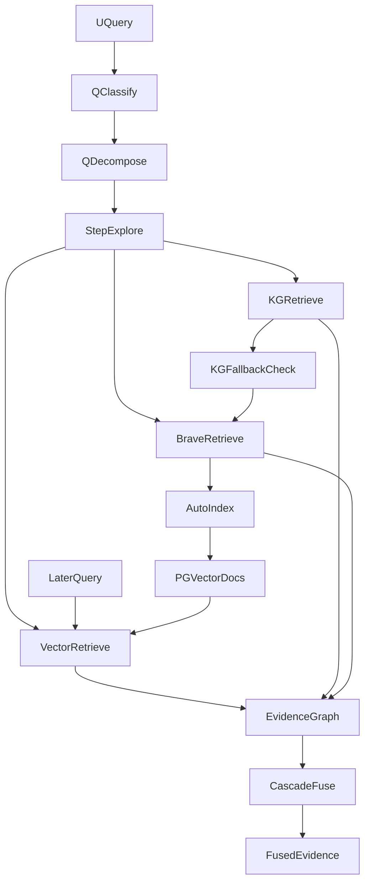

# 检索Agent补充文档 v1.1 - Brave结果进入RAG与KG链路详解

**文档版本**: v1.1  
**创建日期**: 2026-02-10  
**适用范围**: 检索Agent(Web检索 + RAG + KG + Cascade)

---

## 1. 你最关心的问题先回答

### 1.1 Brave结果到底怎么进系统

结论分两层:

1. **同一轮查询内(在线链路)**  
   Brave返回会直接作为 `web_result` 节点进入证据图, 并被当作**广度证据**参加 Cascade 融合。

2. **后续查询(跨轮链路)**  
   Brave返回会被可选地自动写入 PGVector(`documents` 表), 后续由 `VectorRetriever` 按向量相似度检索回来, 这时内容表现为 `document_chunk`。

### 1.2 Brave结果会不会直接进入KG

**不会直接写入 Neo4j KG**。  
当前实现里, Brave只做:
- 在线证据补充(`web_result`)。
- 可选向量库沉淀(PGVector)。

它**不会**把网页内容自动抽实体后写入 KG。

---

## 2. 术语对齐(避免概念混淆)

- `RAG`:
  - 严格定义: 从向量库检索 `document_chunk`。
  - 宽口径定义(本项目融合语义): 广度侧证据, 包括 `document_chunk + web_result`。
- `KG`:
  - Neo4j中的结构化图检索, 产物是 `kg_match / reasoning_chain`。
- `Brave`:
  - 外部Web搜索来源, 产物是 `web_result`。

---

## 3. 同轮在线链路(一次用户请求内)

下面是一次 `/api/v1/agent/chat` 请求里 Brave 数据的实际流向。

### 3.1 进入点: TreeExplorer分支执行

文件: `app/agents/retrieval/tree_explorer.py`

1. 当分支策略是 `rag` 或 `both`:
   - 先跑 `VectorRetriever.retrieve()`。
   - 再跑 `BraveWebRetriever.retrieve()` 进行Web增强。

2. 当分支策略是 `kg`:
   - 先跑 `KGRetriever.retrieve()`。
   - 若 `kg_nodes` 为空, 则回退尝试 `BraveWebRetriever.retrieve()`。

这一步生成的 Brave 节点类型是 `content_type="web_result"`。

### 3.2 进入证据图后的融合角色

文件: `app/agents/retrieval/agent.py`

检索Agent会把探索结果拆成:

- `breadth_nodes`: `document_chunk` + `web_result`
- `depth_nodes`: `kg_match` + `reasoning_chain`

然后传给 `CascadeFuser.fuse()`。  
所以 Brave 同轮不是“先转成KG”再融合, 而是直接作为广度证据参与融合。

### 3.3 下游消费

- 生成Agent(`app/agents/generation/content_generator.py`):
  - 允许读取 `web_result` 作为可填槽证据。
- 评估Agent(`app/agents/evaluation/agent.py`):
  - 把 `web_result` 纳入证据集合, 一起做匹配评估。

---

## 4. 跨轮离线链路(Brave如何进入后续RAG)

文件: `app/agents/retrieval/web_retriever.py`

当 `BRAVE_AUTO_INDEX_TO_VECTOR=true` 时, 每次 Brave 检索后会执行:

1. `vector_store.ensure_table()`
2. 对Top N结果做 embedding
3. `vector_store.batch_upsert(documents)`
4. 文档写入 `documents` 表, metadata含:
   - `source_type=brave_search`
   - `engine=brave_search`
   - `url/title/rank/query`

后续用户查询时, `VectorRetriever` 对 PGVector 做相似度检索,  
这些由 Brave 沉淀的文档会以 `document_chunk` 形式被检出, 从而进入经典 RAG 路径。

> 关键点:  
> **Brave -> PGVector -> 后续VectorRetriever命中 -> document_chunk**  
> 这是“Brave进入RAG”的跨轮闭环。

---

## 5. Brave与KG关系的边界

### 5.1 当前已实现

1. KG分支空结果时, Brave可作为“补救证据源”。
2. Brave结果参与融合, 提高回答覆盖度。

### 5.2 当前未实现

1. 自动网页抽取实体并写入 Neo4j。
2. 将 `web_result` 映射为 KG 三元组并持久化。

如果未来要实现“Brave进入KG”, 需要新增一条独立管道:

- `web_result` 清洗
- 实体/关系抽取
- 冲突消解与去重
- Neo4j upsert与版本化回滚

---

## 6. 时序图(当前真实实现)



---

## 7. 数据契约表(你排查时最有用)

| 阶段 | 产物类型 | 关键字段 | 写入位置 | 下游用途 |
|---|---|---|---|---|
| Brave在线检索 | `web_result` | `url/title/snippet/rank/query` | `EvidenceGraph.nodes` | 融合、生成、评估 |
| Brave自动沉淀 | vector doc | `metadata.source_type=brave_search` | PGVector `documents` | 后续RAG召回 |
| RAG召回 | `document_chunk` | `doc_metadata` | `EvidenceGraph.nodes` | 融合、生成、评估 |
| KG召回 | `kg_match/reasoning_chain` | `kg_node_id/labels/depth` | `EvidenceGraph.nodes` | 融合、评估 |

---

## 8. 开关与参数

文件: `app/core/config.py`

- `BRAVE_SEARCH_ENABLED`: 是否启用Brave检索
- `BRAVE_SEARCH_API_KEY`: Brave鉴权
- `BRAVE_SEARCH_TOP_K`: 每个查询返回条数
- `BRAVE_AUTO_INDEX_TO_VECTOR`: 是否自动沉淀到PGVector
- `BRAVE_AUTO_INDEX_MAX_ITEMS`: 每次最多沉淀条数
- `BRAVE_AUTO_INDEX_MIN_CONTENT_CHARS`: 低于该长度不入库

---

## 9. 日志与验收方法

建议优先观察这些日志事件:

- `web_retrieval_complete`
- `brave_auto_index_complete`
- `retrieval_pipeline_complete`(看 `web_results` 字段)

建议SQL验收:

```sql
SELECT COUNT(*) AS brave_docs
FROM documents
WHERE metadata->>'source_type' = 'brave_search';
```

---

## 10. 常见误解纠偏

1. 误解: Brave结果会直接进入KG。  
   纠偏: 当前不会写Neo4j, 只会进证据图与向量库。

2. 误解: Brave结果本轮一定变成 `document_chunk`。  
   纠偏: 本轮是 `web_result`, 只有沉淀后在后续查询中才可能以 `document_chunk` 被检索出来。

3. 误解: 开启Brave后就不需要KG。  
   纠偏: Brave补充广度, KG负责结构关系与多跳语义, 两者是互补关系。

---

## 11. 为什么会出现"有Web证据但回答说证据不足"

你给出的案例:

- 查询: `鹿紫云能不能打过五条悟`
- 检索指标: `web_result_count` 很高, 且融合节点存在有效内容
- 最终输出: `证据不足`

这类现象在当前管道里通常不是"检索失败", 而是"生成阶段证据筛选过严"。

### 11.1 触发路径

1. 检索阶段成功:
   - 已拿到 `web_result` 和 `fused_evidence`
2. 生成阶段开始槽位填充:
   - `ContentGenerator._gather_evidence_by_hint()` 会先做关键词相关性门控
3. 若关键词提取过粗(例如把整句当成一个词):
   - 相关性过滤可能把候选证据全部筛空
4. 候选证据为空:
   - 槽位提取只能返回 `value=null` + `source_evidence_ids=[]`
5. `assemble_output()` 看到全部槽位为空:
   - 返回统一的"证据不足"文案

### 11.2 典型根因

- 中文 query 关键词提取不够细粒度, 导致:
  - `鹿紫云能不能打过五条悟` 被当成单一长关键词
  - 该长串不在证据文本中完整出现
  - 候选证据被误判为"不相关"

### 11.3 修复方向(已在代码实现中落地)

1. **统一关键词提取器**:
   - 引入 `QueryKeywordExtractor` 统一管理关键词提取。
   - Proposal阶段, Content阶段, 输出提示阶段复用同一套规则。
2. **在线词典与分词**:
   - 使用 `stopwordsiso` 作为停用词来源。
   - 使用 `jieba` 做中文分词, 避免整句当单一关键词。
3. **可选LLM拆分**:
   - 通过配置开关可启用LLM拆query关键词。
   - 默认仍使用本地提取器, 控制时延与成本。
4. **相关性门控兜底**:
   - 若关键词过滤后为空, 回退使用过滤前候选, 避免"误杀全部证据"。

### 11.4 验证信号

修复后应观察到:

1. `generated_content.metadata.evidence_count > 0`
2. `filled_count > 0`(至少核心槽位可填)
3. 最终回答不再走统一"证据不足"短路分支

---

**文档结束**
